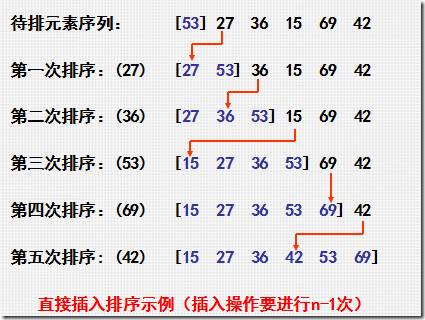
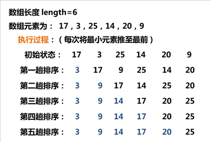
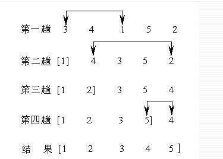
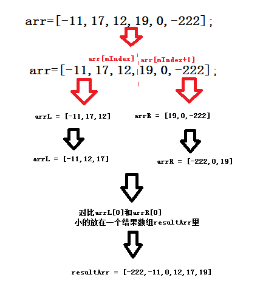
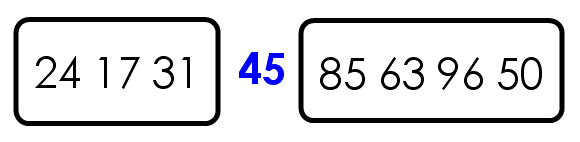
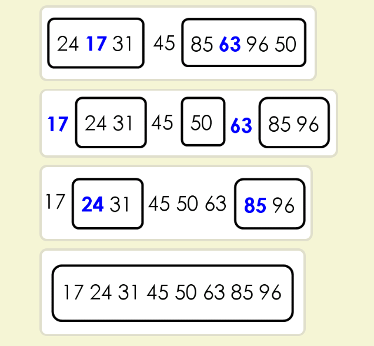

# algorithms-demos

## 直接插入排序（Insert Sort）

**原理图：**



**介绍**：最普通的排序算法， 从数组下标1开始每增1项排序一次，越往后遍历次数越多。

**实际代码**：

```javascript
// 插入排序 从下标1开始每增1项排序一次，越往后遍历次数越多
function insertSort(array) {
  var len = array.length,
      i, j, tmp, result;

  // 设置数组副本
  result = array.slice(0);
  for(i=1; i < len; i++){
    tmp = result[i];
    j = i - 1;
    while(j>=0 && tmp < result[j]){
      result[j+1] = result[j];
      j--;
    }
    result[j+1] = tmp;
  }
  return result;
}
```

算法分析

最佳情况：输入数组按升序排列。T(n) = O(n) 
最坏情况：输入数组按降序排列。T(n) = O(n^2) 
平均情况：T(n) = O(n^2)

如果目标是把n个元素的序列升序排列，那么采用插入排序存在最好情况和最坏情况。最好情况就是，序列已经是升序排列了，在这种情况下，需要进行的比较操作需（n-1）次即可。最坏情况就是，序列是降序排列，那么此时需要进行的比较共有n(n-1)/2次。插入排序的赋值操作是比较操作的次数加上 (n-1）次。平均来说插入排序算法的时间复杂度为O(n^2）。因而，插入排序不适合对于数据量比较大的排序应用。但是，如果需要排序的数据量很小，例如，量级小于千，那么插入排序还是一个不错的选择。

## 二分插入排序（）

## 冒泡排序（Bubble sort）

**原理图：**



**介绍**：比较相邻的两个数，如果后面的比前面的小，把小的放在前面。

**时间复杂度**:  O(n^2)

**动画演示**：[冒泡排序](http://www.webhek.com/post/comparison-sort.html)

**实际代码**：

```javascript
/**
对比arr中的第j+1项和第j项，如果第j+1项小于第j项，就把第j+1项和第j项调换位置。如果没达到最终的顺序（从小到大），就继续找，继续换，直到达到最终效果
*/ 
function bubbleSort(arr) {
    for(var i = 0; i < arr.length - 1; i++) {
        for(var j = 0; j < arr.length - 1; j++) {
            if (arr[j+1] < arr[j]) {
                temp = arr[j+1];
                arr[j+1] = arr[j];
                arr[j] = tmp;
            }
        }
    }
    return arr;
}
```
但是上面的方法并不完美，如果数组已经是有序了，就没必要再比较了，所以下面有一种优化冒泡排序算法：
```javascript
function bubbleSort(arr){
    var flag = false;  // 定义一个变量为false，未交换位置
    for(var i=0;i<arr.length-1;i++){
        for(var j=0;j<arr.length-1;j++){
            if(arr[j+1]<arr[j]){
                temp = arr[j+1];
                arr[j+1] = arr[j];
                arr[j] = temp;
                flag = true; //true，已交换位置
            }
        }
        if(flag){
            flag = false; //如果交换了位置，将flag重新设为false
        }else{
             break;       //如果未交换，则跳出循环
        }
    }
    return arr;
}
// 或者
function bubbleSort(arr){
    var flag;
    for(var i=0;i<arr.length-1;i++){
        flag =false;
        for(var j=0;j<arr.length-1;j++){
            if(arr[j+1]<arr[j]){
                temp = arr[j+1];
                arr[j+1] = arr[j];
                arr[j] = temp;
                flag = true;
            }
        }
        if(!flag){
            return arr;
        } 
    }
    return arr;
}
```
算法分析

最佳情况：输入数组按升序排列。T(n) = O(n) 
最坏情况：输入数组按降序排列。T(n) = O(n^2) 
平均情况：T(n) = O(n^2)

## 选择排序（selection Sort）

**原理图：**



**介绍**：在乱序的数组中选择最小的值，然后和每次循环后的数组的第一位进行交换

**时间复杂度**:  O((n - 1) + (n - 2) ... + 1)

**动画演示**：[选择排序](http://www.webhek.com/post/comparison-sort.html)

**实际代码**

```javascript
// 在无序区中选出最小的元素，然后将它和无序区的第一个元素交换位置。
// 原理跟冒泡排序一样，算是冒泡的衍生版本
function selectSort(arr){
    var len=arr.length;
    var temp;
    for(var i=0;i<len-1;i++){
        for(var j=i+1;j<len;j++){
            if(arr[j]<arr[i]){
                temp=arr[j];
                arr[j]=arr[i];
                arr[i]=temp;
            }
        }
    }
    return arr;
}
```

## 归并排序（merge Sort）

**原理图：** 



**介绍**： 把一个数组分为两个数组，左边排好序，右边排好序，然后合并到一起排序

**时间复杂度**:  O(n-1)

**动画演示**：[选择排序](http://www.ee.ryerson.ca/~courses/coe428/sorting/mergesort.html)

**实际代码**

```javascript
function mergeSort(arr, s, e){
    if(s > e) {   //起始位置大于终点位置，返回空数组
        return [];
    } else if(s == e) {
        return [arr[s]]; //起始位置等于终点位置，说明数组里只有一个数字，返回只含一个数字的数组    
    }

    var mIndex = Math.floor((s+e)/2); //中间位置的Index
    var arrL = mergeSort(arr,s,mIndex); //将左边的数组排序
    var arrR = mergeSort(arr,mIndex+1,e); //将右边的数组排序
    
    var resultArr = []; // 结果数组
    while(arrL.length > 0 || arrR.length > 0) { //当左右两个数组都不为空时
        if(arrL[0]<arrR[0]){
            resultArr.push(arrL.shift());
        }else{
            resultArr.push(arrR.shift());
        }

        if(arrL.length==0){  // 当左边的数组为空时
            resultArr = resultArr.concat(arrR);
            break;
        }else if(arrR.length==0){
            resultArr = resultArr.concat(arrL);
            break;
        }
    }
    return resultArr;
}

var arr=[-11, 17, 12, 19, 0, -222];
console.log(mergeSort(arr,0,arr.length-1));
```

## 快速排序（Quick Sort）

"快速排序"的思想很简单，整个排序过程只需要三步：

（1）在数据集之中，选择一个元素作为"基准"（pivot）。

（2）所有小于"基准"的元素，都移到"基准"的左边；所有大于"基准"的元素，都移到"基准"的右边。

（3）对"基准"左边和右边的两个子集，不断重复第一步和第二步，直到所有子集只剩下一个元素为止。

举例来说，现在有一个数据集{85, 24, 63, 45, 17, 31, 96, 50}，怎么对其排序呢？

第一步，选择中间的元素45作为"基准"。（基准值可以任意选择，但是选择中间的值比较容易理解。）


第二步，按照顺序，将每个元素与"基准"进行比较，形成两个子集，一个"小于45"，另一个"大于等于45"。



第三步，对两个子集不断重复第一步和第二步，直到所有子集只剩下一个元素为止。



```javascript
var quickSort = function(arr) {
　　if (arr.length <= 1) { return arr; }
　　var pivotIndex = Math.floor(arr.length / 2);
　　var pivot = arr.splice(pivotIndex, 1)[0];
　　var left = [];
　　var right = [];
　　for (var i = 0; i < arr.length; i++){
　　　　if (arr[i] < pivot) {
　　　　　　left.push(arr[i]);
　　　　} else {
　　　　　　right.push(arr[i]);
　　　　}
　　}
　　return quickSort(left).concat([pivot], quickSort(right));
};
```
算法分析

最佳情况：T(n) = O(nlogn) 
最差情况：T(n) = O(n2) 
平均情况：T(n) = O(nlogn)
